# 종합실습 4 · E-Commerce 매출 분석

전자상거래(ecom) 스키마에서 매출·고객·재고를 분석하고 문항별 실행계획을 튜닝한 실습.

- 작성자 : 광주 3반 신주용
- 작성일 : 2026-07-24
- GitHub : https://github.com/kimddong23/skala-database-sql-practicum-4
- 주제 : **매출 분석 Q1~Q11 · 문항별 튜닝 전/후 · 조인 3종 · Materialized View**
- DB : `ecom_db (ecom 스키마 · 14테이블)` · PostgreSQL 17

## 개요
- 스키마 : country·customers·addresses·categories(계층)·products·product_prices(SCD2·EXCLUDE)·suppliers·product_suppliers·inventory·orders·order_items(line_total GENERATED)·payments·shipments·reviews
- 분석 : GMV·월별매출/AOV·카테고리 Top10·RANK·RFM·재구매율·재고임계·효자상품·쿠폰효과·상위1%·안전 나눗셈
- 성능 : 문항별 EXPLAIN (ANALYZE, BUFFERS) 전/후 · 조인 3종(NLJ/Hash/Merge) · mv_daily_gmv(15시 갱신 설계)

## 코드 구조
```
Day4_종합실습4_ecommerce/
├── sql/                     # SQL 스크립트
│   ├── 00_schema.sql        # ecom 스키마 (14테이블 · MView · UDF · View)
│   ├── 01_seed.sql          # 실습 데이터 적재 (600상품 · 3,000고객)
│   ├── 02_queries.sql       # Q1~Q11 · 문항별 튜닝 전/후 + EXPLAIN
│   ├── 03_explain_mview.sql # 조인 3종 비교 + Materialized View
│   ├── 04_operations.sql    # 운영 심화 (함수·프로시저·트리거·RLS·모니터링)
├── erd/                     # ERD 도식(png·html)
├── docs/                    # 리포트 PDF · pdf_pages(페이지 미리보기)
└── README.md · .gitignore
```

## 실행 방법
```bash
psql -d postgres -f sql/00_schema.sql
psql -d ecom_db -f sql/01_seed.sql
psql -d ecom_db -f sql/02_queries.sql
psql -d ecom_db -f sql/03_explain_mview.sql
psql -d ecom_db -f sql/04_operations.sql
```

## 성능 개선 대표 결과 (문항별 튜닝 전/후)
- Q6 재구매율 : 상관 EXISTS → 윈도우 단일 스캔 + 부분 복합 인덱스 — 비용 320,083 → 378 (847배) · 반복 평균 248ms → 1.6ms
- Q1 GMV : 유효 주문 부분 인덱스 — Seq → Bitmap · 비용 639 → 559 / Q7 재고 : 부분 인덱스 — 비용 34 → 7 · Sort 소멸
- Q2·Q5·Q9 : count(DISTINCT) 제거 재작성 — 비용 40~53% 절감 / Q3·Q4 : 최적 판정 + 선택도·커버링 시연

## ERD
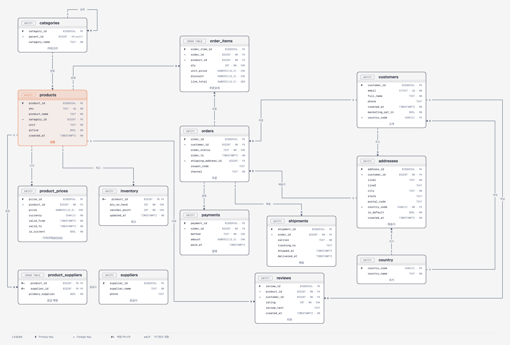

## 분석 리포트
제출 리포트 [`docs/광주_3반_신주용_종합실습4_리포트.pdf`](docs/광주_3반_신주용_종합실습4_리포트.pdf) 전체 페이지 미리보기.


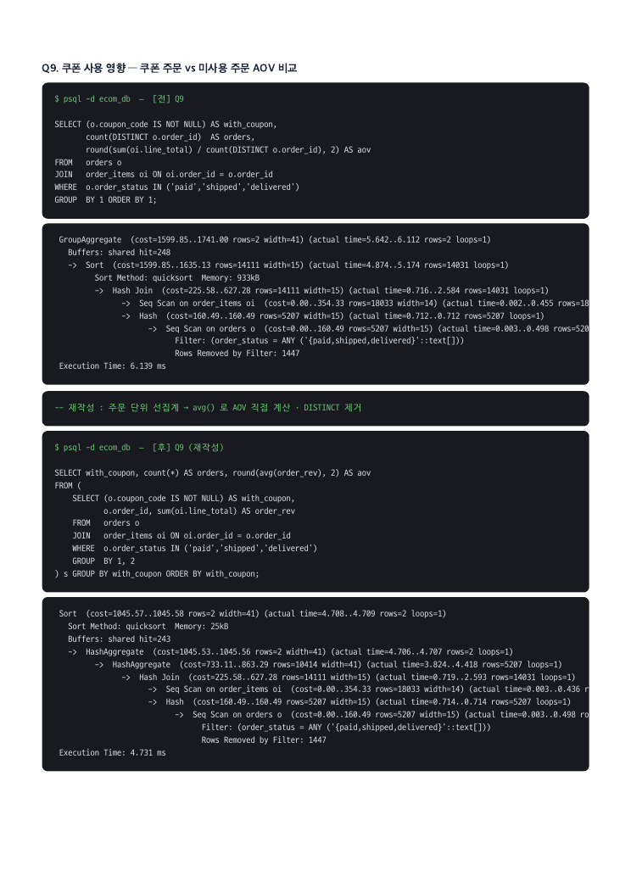

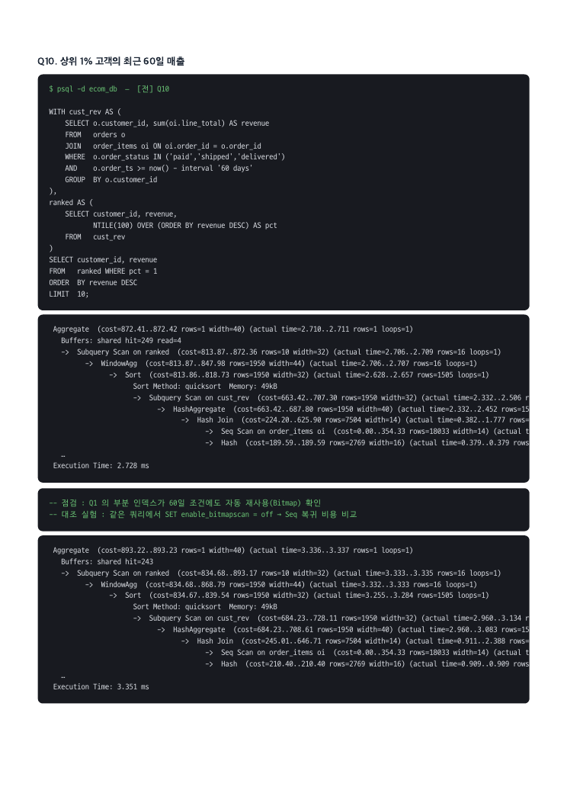
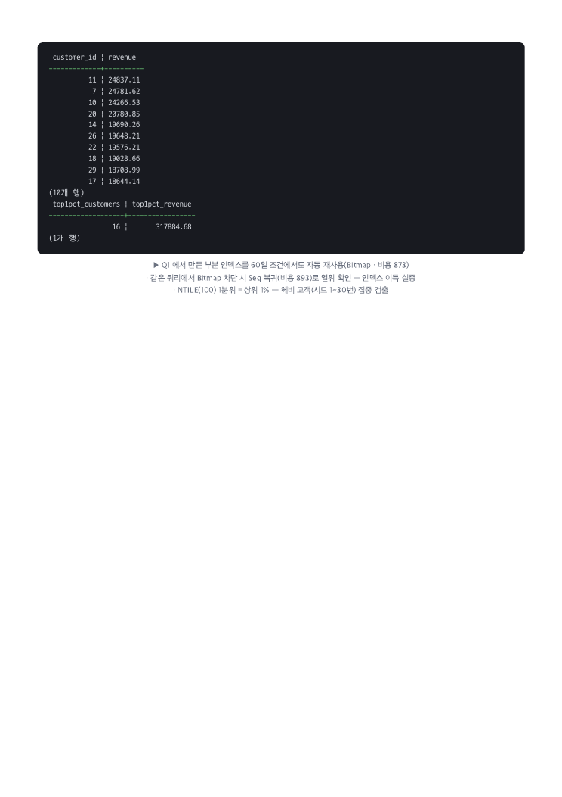
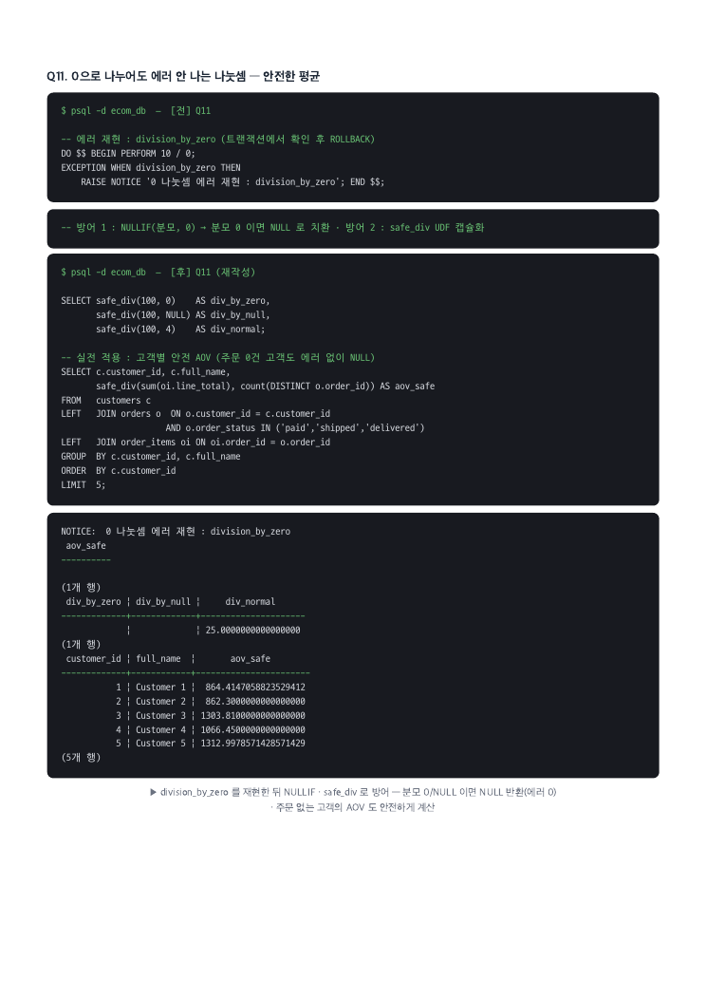
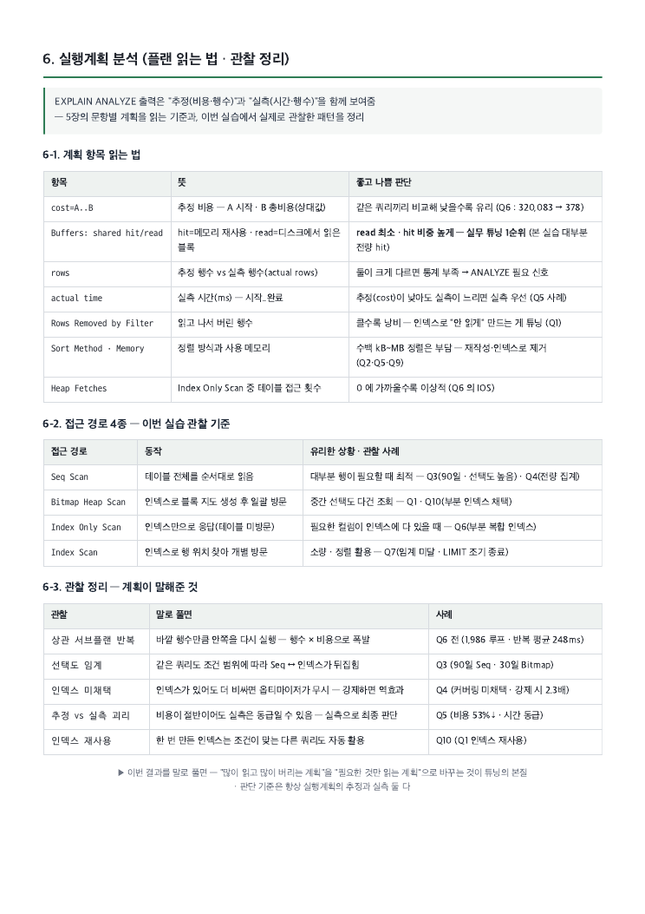
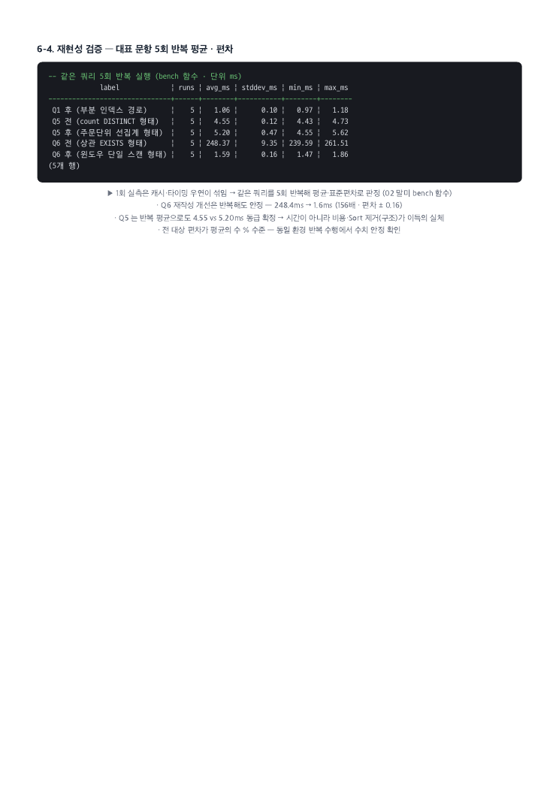
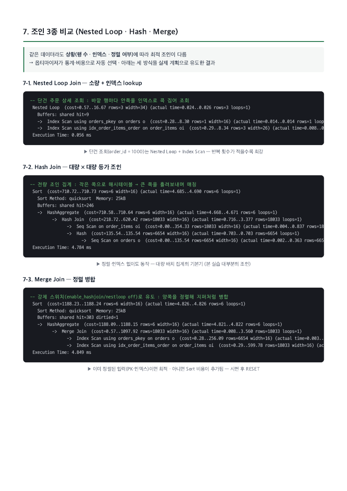

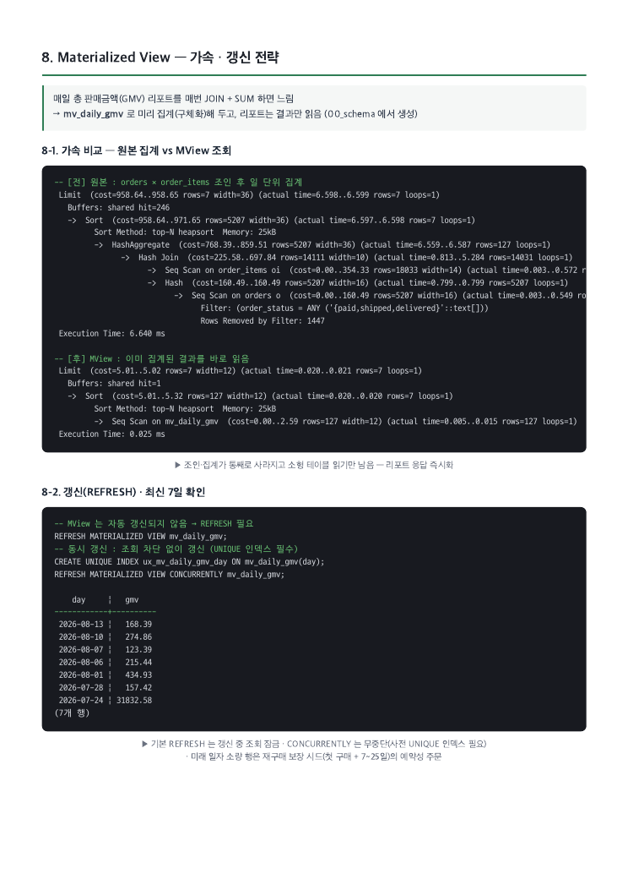
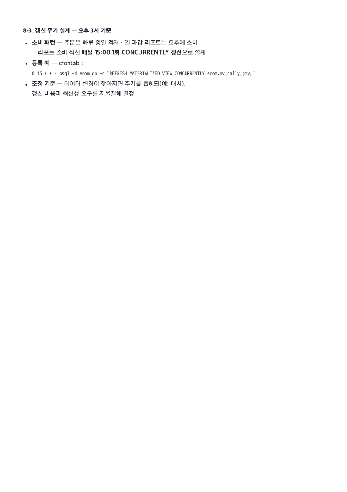
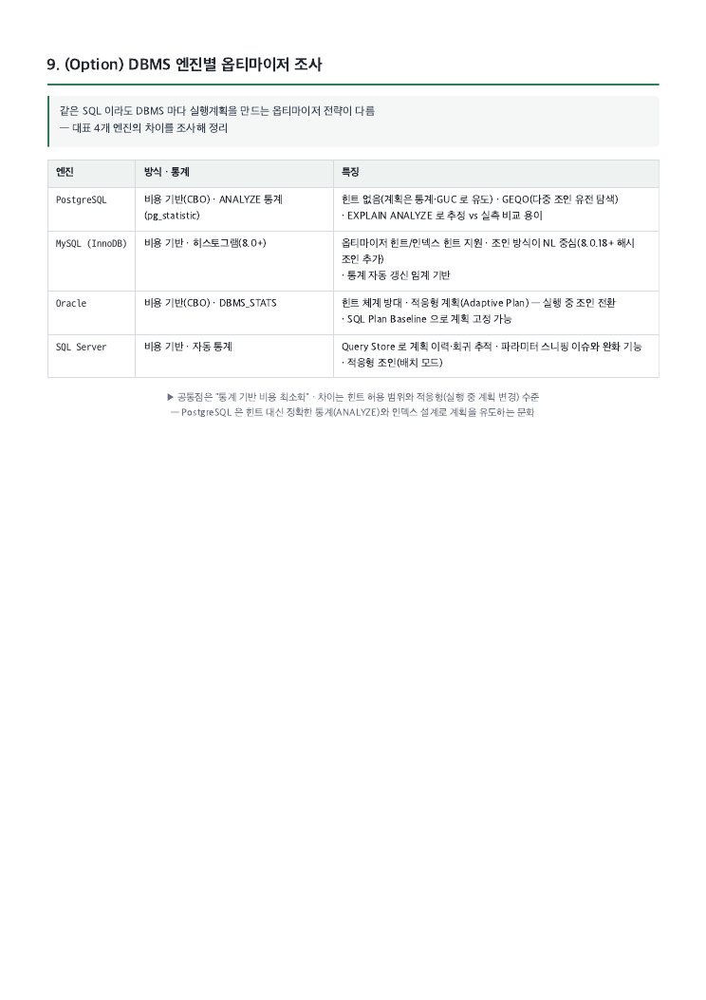
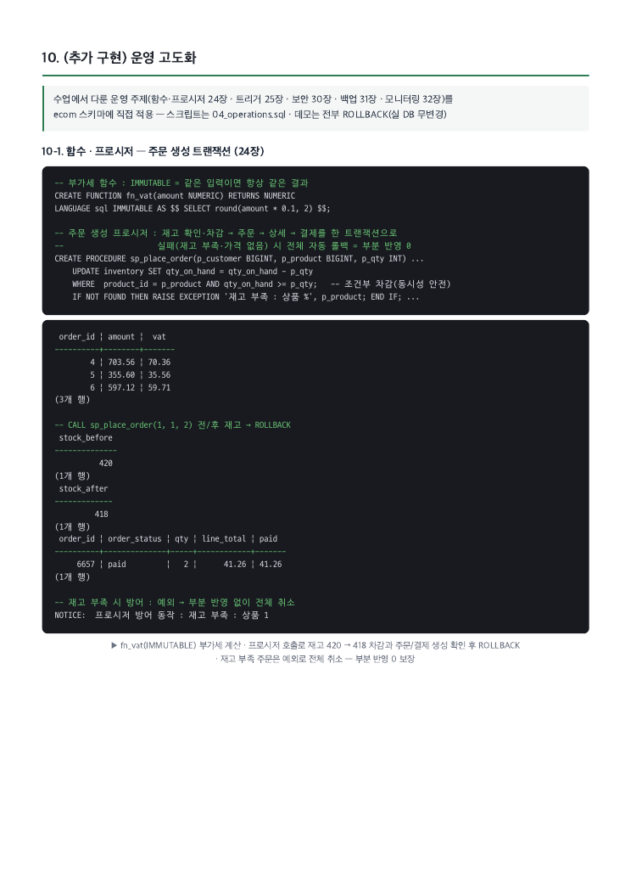


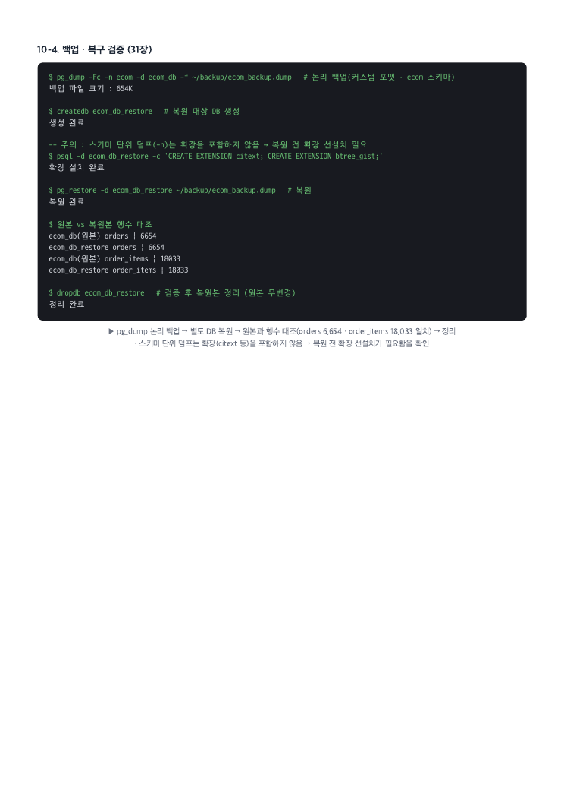
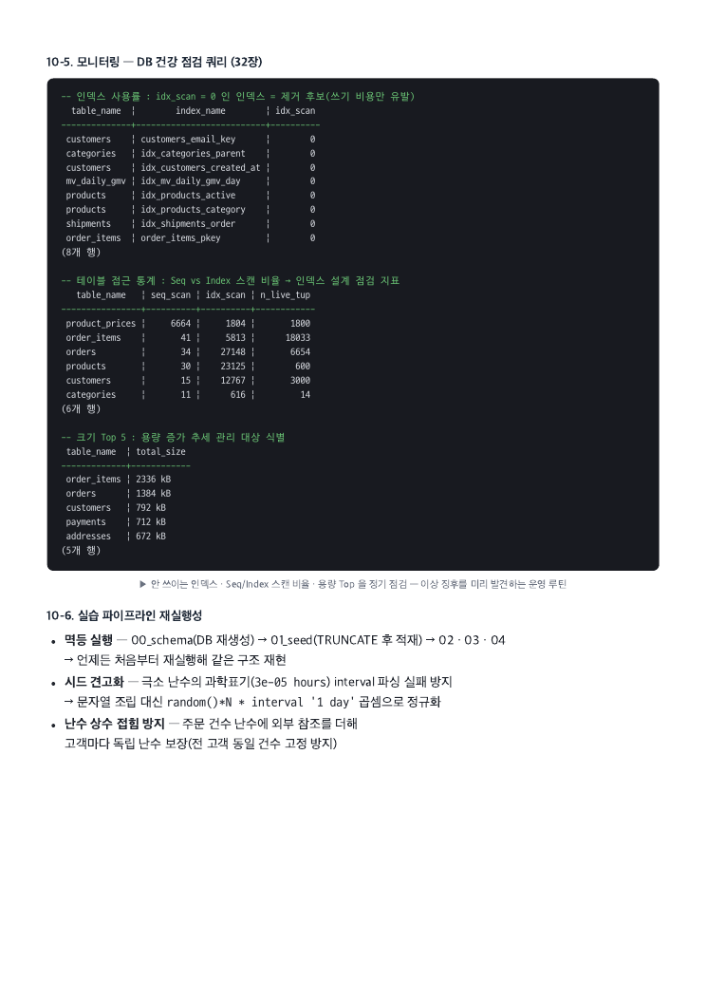

## 설계·간결화 방법
- 쿼리마다 만들고 EXPLAIN (ANALYZE, BUFFERS) 로 점검 → 인덱스/재작성(또는 현행 최적 판정) → 재점검 순서 고정
- 판단 기준 : Buffers(shared read 최소·hit 비중) · 계획 구조(Seq→Index/IOS) · 재현성(5회 반복 평균) — 1회 ms 비교 지양
- 튜닝 인덱스는 운영처럼 누적 적용 — 뒤 문항(Q3·Q10)이 앞 문항 인덱스를 자동 재사용함을 확인
- 반복 집계는 Materialized View 로 캐시 · 리포트 소비 직전 매일 15:00 CONCURRENTLY 갱신 설계
- 운영 심화 : 주문 생성 프로시저(트랜잭션) · 감사 트리거 · RLS · pg_dump 복구 검증 · 모니터링 쿼리

## 변경 이력
- 2026-07-22 최초 작성
- 2026-07-23 리포트 표준 양식(목차·커버리지표·접속화면) 이식
- 2026-07-24 리포트 보완 (실습 제공 ecom 스키마 14테이블 · 문항별 튜닝 전/후 · 조인 3종 · 운영 심화 · Buffers·재현성 기준)